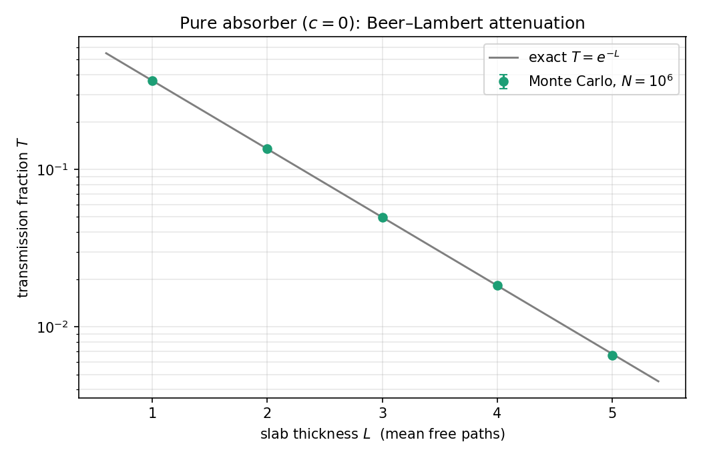
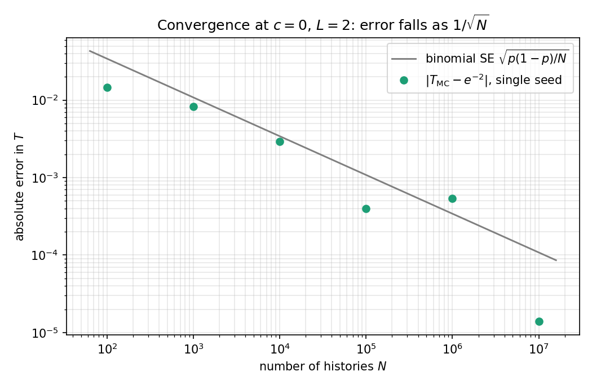
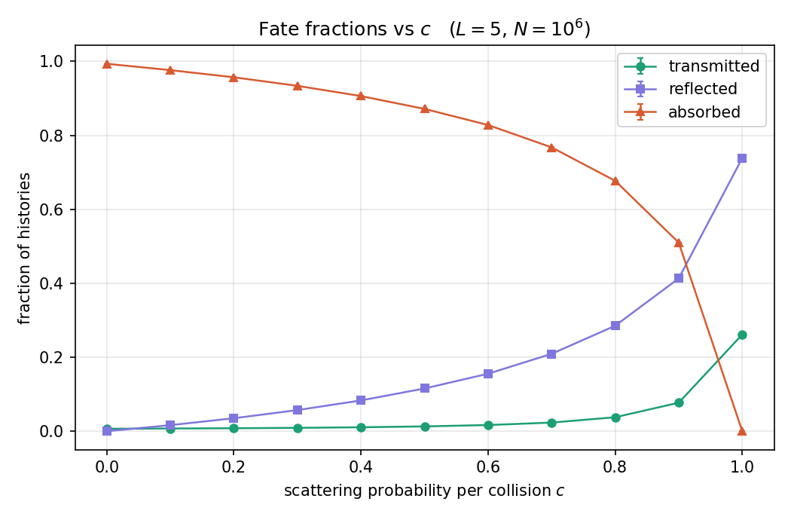

# Monte Carlo neutron transport in a 1D slab

A small, validated Monte Carlo particle-transport engine in C++17, with a Python notebook that turns its output into validation and physics figures.

Monoenergetic neutrons enter a homogeneous slab at normal incidence. Each history alternates random free flights and collisions until the particle is **transmitted** (exits the far face), **reflected** (exits the entry face), or **absorbed**. Working in mean-free-path units (Σₜ = 1) makes the problem dimensionless: a single pair (c, L) — scattering probability per collision and slab thickness — fully specifies it.

Sampling rules:

| quantity | rule | why |
|---|---|---|
| free path | s = −ln ξ | inverse-transform sampling of the exponential first-collision law e^(−s) |
| scatter vs absorb | scatter if ξ < c | c = Σₛ/Σₜ is the per-collision scattering probability |
| new direction | μ′ = 2ξ − 1 | isotropic in the lab frame ⇒ the direction cosine is uniform on (−1, 1) |
| move | x ← x + s·μ | 1-D projection of a 3-D flight |

Tallies over N independent histories are binomial, so every reported fraction p carries a standard error √(p(1−p)/N) — those are the error bars in every figure below.

## Validation

Running `./neutron` executes a 20-configuration suite that grades itself against pre-registered expectations, prints PASS/FAIL per row, and returns a nonzero exit code on any failure.

**1. Beer–Lambert Law** For a pure absorber (c = 0), transmission requires crossing the slab uncollided, so T = e^(−L) exactly, and reflection is impossible without a scatter (R ≡ 0). All five points at N = 10⁶ agree within 1.6σ, with no fit parameters anywhere:



**2. Conservation.** T + R + A = N is enforced on every batch. The fate `enum class` plus an exhaustive `switch` tally means a history that ends in an impossible state throws rather than silently vanishing from the count.

**3. Convergence.** Where the exact answer is known (c = 0, L = 2), the absolute error of a single run tracks the binomial standard-error envelope ∝ 1/√N across five orders of magnitude in N:



## Results

The interesting regime is intermediate c, where no closed form exists — the reason the method exists at all. Scattering opens a second channel through the slab: particles that would have died at their first collision can random-walk out of either face. Between c = 0 and c = 1, transmission rises roughly 40× while absorption collapses to exactly zero:



## Build and run

```bash
g++ -std=c++17 -O2 -Wall -Wextra -o neutron main.cpp
./slab_transport      # runs the suite, writes results.csv, prints PASS/FAIL per check
jupyter nbconvert --to notebook --execute --inplace plotting.ipynb   # regenerates figures/
```

The full suite (≈ 2.6 × 10⁷ histories) runs in seconds. Every CSV row records the settings and seed that produced it, so any experiment is exactly reproducible.

## Layout

```
main.cpp   # engine: Particle, Material, transport kernel, self-grading batch driver
results.csv          # one row per experiment: settings, counts, fractions, standard errors
plotting.ipynb       # figures + deviation (z-score) table
figures/             # PNGs embedded above
```

## Physics notes and extensions

Natural extensions: implicit capture and other variance-reduction schemes, energy dependence, and 3-D geometry. The inverse-transform sampling, simulated stochastic paths, a tallied estimator with quantified 1/√N convergence, and validation against a closed-form limit — is the same one used for Monte Carlo option pricing.
